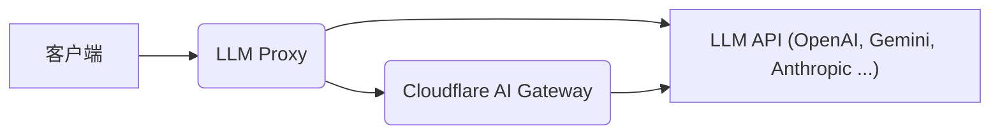

# LLM Proxy

通用 LLM API 代理，支持多厂商统一鉴权与 Key 轮询。可部署至 Node.js、Vercel、Docker。

基于 [Vafast](https://github.com/nicepkg/vafast) 框架构建，灵感来自 [LiteLLM](https://github.com/BerriAI/litellm)。

## 功能特性

- **统一鉴权** — 用一个 `PROXY_API_KEY` 代理所有 LLM 厂商
- **透传端点** — 请求直接转发至各 LLM 厂商原始 API
  - 例：`/openai/chat/completions`、`/google-ai-studio/v1beta/models/gemini-2.5-pro:generateContent`
- **OpenAI 兼容端点** — 无缝接入 OpenAI SDK 和已有工具
  - `/v1/chat/completions`
  - `/v1/models`
- **Cloudflare AI Gateway 集成** — 可选接入 [AI Gateway](https://developers.cloudflare.com/ai-gateway/) 实现日志、分析、限流等
- **全局轮询 Key** — 通过 Upstash Redis 或内存实现分布式 Key 轮询
- **路径参数选 Key** — URL 中使用 `/key/{index|range}/` 指定或限定 API Key 范围


```mermaid
flowchart LR
  A[客户端] --> B(LLM Proxy)
  B --> C(Cloudflare AI Gateway)
  B --> D
  C --> D["LLM API (OpenAI, Gemini, Anthropic ...)"]
```

## 支持的厂商

| 厂商             | Chat Completions | 透传 | AI Gateway | 路由名              | 环境变量                                     |
| ---------------- | :--------------: | :--: | :--------: | ------------------- | -------------------------------------------- |
| OpenAI           | ✅               | ✅   | ✅         | `openai`            | `OPENAI_API_KEY`                             |
| Google AI Studio | ✅               | ✅   | ✅         | `google-ai-studio`  | `GEMINI_API_KEY`                             |
| Anthropic        | ✅               | ✅   | ✅         | `anthropic`         | `ANTHROPIC_API_KEY`                          |
| Cerebras         | ✅               | ❌   | ✅         | `cerebras`          | `CEREBRAS_API_KEY`                           |
| Cohere           | ✅               | ✅   | ✅         | `cohere`            | `COHERE_API_KEY`                             |
| DeepSeek         | ✅               | ✅   | ✅         | `deepseek`          | `DEEPSEEK_API_KEY`                           |
| Grok             | ✅               | ✅   | ✅         | `grok`              | `GROK_API_KEY`                               |
| Groq             | ✅               | ✅   | ✅         | `groq`              | `GROQ_API_KEY`                               |
| Mistral          | ✅               | ✅   | ✅         | `mistral`           | `MISTRAL_API_KEY`                            |
| Perplexity       | ✅               | ✅   | ✅         | `perplexity`        | `PERPLEXITY_API_KEY`                         |
| OpenRouter       | ✅               | ✅   | ✅         | `openrouter`        | `OPENROUTER_API_KEY`                         |
| Workers AI       | ✅               | ✅   | ✅         | `workers-ai`        | `CLOUDFLARE_ACCOUNT_ID` `CLOUDFLARE_API_KEY` |
| HuggingFace      | ❌               | ✅   | ✅         | `huggingface`       | `HUGGINGFACE_API_KEY`                        |
| Replicate        | ❌               | ✅   | ✅         | `replicate`         | `REPLICATE_API_KEY`                          |
| Ollama           | ✅               | ✅   | ❌         | `ollama`            | `OLLAMA_API_KEY`                             |

## 快速开始

### 环境要求

- **Node.js** >= 22.12

### 安装与运行

```bash
# 克隆项目
git clone <repo-url> && cd llm-proxy

# 安装依赖
npm install

# 复制环境变量模板
cp .env.example .env.development

# 编辑 .env.development，填入你的 API Keys
# 然后启动开发服务器
npm run dev
```

### 部署方式

**Node.js / Docker：**

```bash
npm run build
npm run start
```

**Vercel：**

通过 `vercel-build` 脚本将 `src/vercel.ts` 打包为 `api/index.mjs` 后部署到 Vercel。

<details>
<summary><strong>Vercel 部署指南（点击展开）</strong></summary>

#### 1. 通过 GitHub 自动部署（推荐）

1. 将项目推送到 GitHub
2. 在 [vercel.com](https://vercel.com) 点击 **Add New Project** → 导入仓库
3. 配置项：
   - **Application Preset**: `Other`
   - **Root Directory**: `./`
   - **Build and Output Settings**: 全部保持默认（不要开启覆盖）
4. 在 **Environment Variables** 中添加所需变量（见下方表格）
5. 点击 **Deploy**

部署后每次 push 到 `main` 分支会自动部署生产环境，其他分支生成 Preview URL。

#### 2. 通过 CLI 部署

```bash
npm i -g vercel
vercel login
vercel          # 首次部署，按提示配置
vercel --prod   # 部署到生产环境
```

#### 环境变量配置

在 Vercel Dashboard → Settings → Environment Variables 中添加，也可以点击 **Import .env** 粘贴以下内容后修改：

```env
PROXY_API_KEY=
OPENAI_API_KEY=
GEMINI_API_KEY=
ANTHROPIC_API_KEY=
CEREBRAS_API_KEY=
COHERE_API_KEY=
DEEPSEEK_API_KEY=
GROK_API_KEY=
GROQ_API_KEY=
MISTRAL_API_KEY=
OPENROUTER_API_KEY=
HUGGINGFACE_API_KEY=
PERPLEXITYAI_API_KEY=
REPLICATE_API_KEY=
CLOUDFLARE_API_KEY=
OLLAMA_API_KEY=
CUSTOM_OPENAI_ENDPOINTS=
KV_REST_API_URL=
KV_REST_API_TOKEN=
CLOUDFLARE_ACCOUNT_ID=
AI_GATEWAY_NAME=
CF_AIG_TOKEN=
DEV=false
DEFAULT_MODEL=
ENABLE_GLOBAL_ROUND_ROBIN=false
```

| 变量 | 必填 | 说明 |
|------|:----:|------|
| `PROXY_API_KEY` | **是** | 代理鉴权密钥，客户端通过 `Authorization: Bearer <key>` 访问。支持逗号分隔配置多个 Key |
| `DEV` | 否 | 设为 `true` 跳过鉴权，**生产环境务必设为 `false`** |
| `DEFAULT_MODEL` | 否 | 当请求 model 为 `default` 时使用的默认模型，格式：`provider/model` |
| Provider Keys | 否 | 用到哪个厂商就填哪个，不用的留空。支持逗号分隔配置多 Key 实现轮询 |
| `CUSTOM_OPENAI_ENDPOINTS` | 否 | JSON 字符串，配置自定义 OpenAI 兼容端点 |
| `ENABLE_GLOBAL_ROUND_ROBIN` | 否 | 设为 `true` 开启全局 Key 轮询 |
| `KV_REST_API_URL` | 否 | Upstash Redis REST URL，开启全局轮询时配置以支持分布式（不配则用内存轮询） |
| `KV_REST_API_TOKEN` | 否 | Upstash Redis REST Token |
| `CLOUDFLARE_ACCOUNT_ID` | 否 | Cloudflare AI Gateway 所需的账户 ID |
| `AI_GATEWAY_NAME` | 否 | 默认 AI Gateway 名称，也可通过 `/g/:gatewayName/` 路径动态指定 |
| `CF_AIG_TOKEN` | 否 | AI Gateway 认证 Token |

#### 构建原理

Vercel 部署时自动执行 `npm run vercel-build`：

1. 使用 esbuild 将 `src/vercel.ts` 及其所有依赖打包为单文件 `api/index.mjs`
2. Vercel 检测到 `api/index.mjs` 并作为 Serverless Function 部署
4. `vercel.json` 的 rewrite 规则将所有请求路由到该 Function

#### 注意事项

- **关闭 Deployment Protection**：默认 Vercel 可能开启部署保护，会拦截 API 请求。前往 Settings → Deployment Protection，将 Production 设为 **Standard Protection**（关闭 Vercel Authentication），否则 API 调用会返回登录页面
- **冷启动**：Vercel Serverless Function 存在冷启动延迟（通常 200-500ms），频繁使用时会保持热状态
- **执行时长限制**：Hobby 计划函数最长执行 10 秒，Pro 计划 60 秒。流式响应不受此限制
- **区域选择**：可在 Settings → Functions → Function Region 选择离你或目标 LLM API 更近的区域
- **环境变量更新后需重新部署**：修改环境变量后需触发一次新的部署才能生效（推送一次 commit 或在 Dashboard 手动 Redeploy）

#### 验证部署

```bash
# 健康检查（不需要鉴权）
curl https://your-domain.vercel.app/ping

# 查看所有可用模型
curl https://your-domain.vercel.app/v1/models \
  -H "Authorization: Bearer YOUR_PROXY_API_KEY"

# 查看 Provider 状态和 Key 连通性
curl https://your-domain.vercel.app/status \
  -H "Authorization: Bearer YOUR_PROXY_API_KEY"
```

</details>

## 环境变量

参考 `.env.example` 获取完整列表。

### 必填

| 变量 | 说明 |
|------|------|
| `PROXY_API_KEY` | 代理鉴权密钥（非 DEV 模式下必填） |

### Cloudflare AI Gateway（可选）

| 变量 | 说明 |
|------|------|
| `CLOUDFLARE_ACCOUNT_ID` | Cloudflare 账户 ID |
| `AI_GATEWAY_NAME` | AI Gateway 名称 |
| `CF_AIG_TOKEN` | AI Gateway 认证 Token |

### 全局 Key 轮询（可选）

| 变量 | 说明 |
|------|------|
| `ENABLE_GLOBAL_ROUND_ROBIN` | 设为 `true` 开启全局轮询（默认 `false`） |
| `KV_REST_API_URL` | Upstash Redis REST URL（分布式轮询时需要） |
| `KV_REST_API_TOKEN` | Upstash Redis REST Token |

未配置 Redis 时自动使用内存轮询（适用于单进程）。

### Provider API Keys

每个厂商的 Key 可以是单个字符串、逗号分隔字符串或 JSON 数组。

### 自定义 OpenAI 兼容端点（可选）

通过环境变量 `CUSTOM_OPENAI_ENDPOINTS` 配置自定义端点：

```json
[
  {
    "name": "my-llm",
    "baseUrl": "https://llm.example.com",
    "apiKeys": ["your-api-key"],
    "models": ["model-1", "model-2"]
  }
]
```

配置后可通过以下方式访问：
- 透传：`/my-llm/chat/completions`
- OpenAI 兼容：在 `/v1/chat/completions` 中使用 `my-llm/model-1` 作为 model

## 路径参数选 Key

在 URL 中添加 `/key/{spec}/` 前缀可指定 API Key：

| 格式 | 说明 | 示例 |
|------|------|------|
| `/key/0/` | 使用第 1 个 Key | `/key/0/v1/chat/completions` |
| `/key/1-3/` | 从 index 1~3 中随机 | `/key/1-3/v1/chat/completions` |
| `/key/2-/` | 从 index 2 到末尾随机 | `/key/2-/v1/chat/completions` |
| `/key/-4/` | 从 index 0 到 4 随机 | `/key/-4/v1/chat/completions` |

范围内的随机选择使用 `crypto.randomInt`（密码学安全随机数）。

## 使用示例

### OpenAI 兼容端点

```bash
# 列出模型
curl https://your-server/v1/models \
  -H "Authorization: Bearer $PROXY_API_KEY"

# Chat Completions
curl -X POST https://your-server/v1/chat/completions \
  -H "Authorization: Bearer $PROXY_API_KEY" \
  -H "Content-Type: application/json" \
  -d '{
    "model": "openai/gpt-4o",
    "messages": [{"role": "user", "content": "Hello!"}]
  }'
```

#### Python (OpenAI SDK)

```python
from openai import OpenAI

client = OpenAI(
    api_key="your-proxy-api-key",
    base_url="https://your-server"
)

response = client.chat.completions.create(
    model="google-ai-studio/gemini-2.5-pro",
    messages=[{"role": "user", "content": "Hello!"}],
)
print(response.choices[0].message.content)
```

### 透传端点

```bash
# OpenAI 原始 API
curl -X POST https://your-server/openai/chat/completions \
  -H "Authorization: Bearer $PROXY_API_KEY" \
  -H "Content-Type: application/json" \
  -d '{"model": "gpt-4o", "messages": [{"role": "user", "content": "Hello!"}]}'

# Google AI Studio 原始 API
curl -X POST https://your-server/google-ai-studio/v1beta/models/gemini-2.5-pro:generateContent \
  -H "Authorization: Bearer $PROXY_API_KEY" \
  -H "Content-Type: application/json" \
  -d '{"contents": [{"role": "user", "parts": [{"text": "Hello!"}]}]}'
```

## 开发

```bash
npm run dev          # 开发服务器（热重载）
npm run test         # 运行测试
npm run lint         # ESLint 检查
npm run tsc          # TypeScript 类型检查
```

## 项目结构

```
src/
├── index.ts              # Node.js 服务入口
├── vercel.ts             # Vercel Serverless Function 入口
├── common/env.ts         # 环境变量（Zod 校验）
├── routes/               # Vafast 路由定义
├── middleware/            # 中间件（鉴权、错误处理、AI Gateway 等）
├── requests/             # 请求处理器
├── providers/            # LLM 厂商适配
├── ai_gateway/           # Cloudflare AI Gateway 集成
└── utils/                # 工具函数
api/                          # Vercel 构建产物（.gitignore）
```

## 已知限制

- 部分 LLM 厂商功能支持不完整（Tool Use、多模态等）
- Azure OpenAI、Vertex AI、Amazon Bedrock 暂未实现
