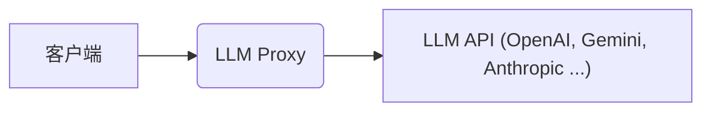

# LLM Proxy

通用 LLM API 代理，支持多厂商统一鉴权与 Key 轮询。可部署至 Node.js、Docker、Railway 等。

基于 [Vafast](https://github.com/nicepkg/vafast) 框架构建，灵感来自 [LiteLLM](https://github.com/BerriAI/litellm)。

## 功能特性

- **统一鉴权** — 用 `PROXY_API_KEY` 或 Admin 创建的 Key 代理所有 LLM 厂商
- **透传端点** — 请求直接转发至各 LLM 厂商原始 API
  - 例：`/openai/chat/completions`、`/google-ai-studio/v1beta/models/gemini-2.5-pro:generateContent`
- **OpenAI 兼容端点** — 无缝接入 OpenAI SDK 和已有工具
  - `/v1/chat/completions`
  - `/v1/models`
- **全局轮询 Key** — 通过 Redis 或内存实现分布式 Key 轮询
- **路径参数选 Key** — URL 中使用 `/key/{index|range}/` 指定或限定 API Key 范围
- **Admin Key 管理** — 通过 `/admin/keys` 动态创建、管理代理 Key（需 PostgreSQL）


```mermaid
flowchart LR
  A[客户端] --> B(LLM Proxy)
  B --> D["LLM API (OpenAI, Gemini, Anthropic ...)"]
```

## 支持的厂商

| 厂商             | Chat Completions | 透传 | 路由名              | 环境变量                                     |
| ---------------- | :--------------: | :--: | ------------------- | -------------------------------------------- |
| OpenAI           | ✅               | ✅   | `openai`            | `OPENAI_API_KEY`                             |
| Google AI Studio | ✅               | ✅   | `google-ai-studio`  | `GEMINI_API_KEY`                             |
| Anthropic        | ✅               | ✅   | `anthropic`         | `ANTHROPIC_API_KEY`                          |
| Cerebras         | ✅               | ❌   | `cerebras`          | `CEREBRAS_API_KEY`                           |
| Cohere           | ✅               | ✅   | `cohere`            | `COHERE_API_KEY`                             |
| DeepSeek         | ✅               | ✅   | `deepseek`          | `DEEPSEEK_API_KEY`                           |
| Grok             | ✅               | ✅   | `grok`              | `GROK_API_KEY`                               |
| Groq             | ✅               | ✅   | `groq`              | `GROQ_API_KEY`                               |
| Mistral          | ✅               | ✅   | `mistral`           | `MISTRAL_API_KEY`                            |
| Perplexity       | ✅               | ✅   | `perplexity`        | `PERPLEXITY_API_KEY`                         |
| OpenRouter       | ✅               | ✅   | `openrouter`        | `OPENROUTER_API_KEY`                         |
| Workers AI       | ✅               | ✅   | `workers-ai`        | `CLOUDFLARE_ACCOUNT_ID` `CLOUDFLARE_API_KEY` |
| HuggingFace      | ❌               | ✅   | `huggingface`       | `HUGGINGFACE_API_KEY`                        |
| Replicate        | ❌               | ✅   | `replicate`         | `REPLICATE_API_KEY`                          |
| Ollama           | ✅               | ✅   | `ollama`            | `OLLAMA_API_KEY`                             |

## 快速开始

### 环境要求

- **Node.js** >= 22.12

### 安装与运行

```bash
# 克隆项目
git clone <repo-url> && cd llm-proxy

# 安装依赖
npm install

# 复制环境变量模板（.env.development 已加入 .gitignore，不会提交）
cp .env.example .env.development

# 编辑 .env.development，填入 PROXY_API_KEY 及 Provider API Keys
# 然后启动开发服务器
npm run dev
```

**首次部署说明：**

- **无数据库**：必须配置 `PROXY_API_KEY`，否则所有请求将返回 401。启动时若未配置会打印 warning 提示
- **有数据库**：配置 `ADMIN_KEY` 和 `DATABASE_URL` 后，需先通过 Admin API 创建 key，再使用该 key 访问代理；或同时配置 `PROXY_API_KEY` 作为备选

### 部署方式

#### Docker

```bash
docker build -t llm-proxy .
docker run -d -p 8787:8787 \
  -e PROXY_API_KEY=your-key \
  -e GEMINI_API_KEY=your-gemini-key \
  llm-proxy
```

#### Railway（推荐）

1. 将项目推送到 GitHub
2. 在 [railway.com](https://railway.com) 创建项目 → Deploy from GitHub repo
3. Railway 自动检测 `Dockerfile` 并构建
4. 在 Variables 中添加环境变量（`PROXY_API_KEY`、Provider Keys 等）
5. 部署完成后自动分配 `xxx.up.railway.app` 域名

#### Node.js 直接运行

```bash
npm run build
node dist/index.mjs
```

需要自行设置环境变量（`export PROXY_API_KEY=...` 或使用 `.env` 工具）。

#### 验证部署

```bash
# 查看所有可用模型
curl https://your-domain/v1/models \
  -H "Authorization: Bearer YOUR_PROXY_API_KEY"

# Chat Completions
curl -X POST https://your-domain/v1/chat/completions \
  -H "Authorization: Bearer YOUR_PROXY_API_KEY" \
  -H "Content-Type: application/json" \
  -d '{"model":"google-ai-studio/gemini-2.5-flash","messages":[{"role":"user","content":"Hello!"}]}'
```

## 环境变量

参考 `.env.example` 获取完整列表。

### 必填

| 变量 | 说明 |
|------|------|
| `PROXY_API_KEY` | 代理鉴权密钥（无 DB 时必填，有 DB 时可与 Admin 创建的 key 二选一） |

### Admin Key 管理（可选）

| 变量 | 说明 |
|------|------|
| `ADMIN_KEY` | 管理员鉴权密钥，用于 `/admin/keys` 接口 |
| `DATABASE_URL` | PostgreSQL 连接串（Railway 部署时自动注入；本地开发连 Railway 时手动填入公网连接串） |

配置 DB 后可通过 Admin API 动态创建 Key，与 `PROXY_API_KEY` 二选一用于鉴权。无 DB 时需配置 `PROXY_API_KEY`。

**首次使用 DB 模式**：配置完成后，需先调用 `POST /admin/keys` 创建 key，返回的 key 用于后续代理请求鉴权。

### 全局 Key 轮询（可选）

| 变量 | 说明 |
|------|------|
| `ENABLE_GLOBAL_ROUND_ROBIN` | 设为 `true` 开启全局轮询（默认 `false`） |
| `REDIS_URL` | Redis 连接串（Railway 部署时自动注入；本地开发连 Railway 时手动填入） |

未配置 Redis 时自动使用内存轮询（适用于单进程）。

### Provider API Keys

每个厂商的 Key 可以是单个字符串、逗号分隔字符串或 JSON 数组。

### 自定义 OpenAI 兼容端点（可选）

通过环境变量 `CUSTOM_OPENAI_ENDPOINTS` 配置自定义端点：

```json
[
  {
    "name": "my-llm",
    "baseUrl": "https://llm.example.com",
    "apiKeys": ["your-api-key"],
    "models": ["model-1", "model-2"]
  }
]
```

配置后可通过以下方式访问：
- 透传：`/my-llm/chat/completions`
- OpenAI 兼容：在 `/v1/chat/completions` 中使用 `my-llm/model-1` 作为 model

## 路径参数选 Key

在 URL 中添加 `/key/{spec}/` 前缀可指定 API Key：

| 格式 | 说明 | 示例 |
|------|------|------|
| `/key/0/` | 使用第 1 个 Key | `/key/0/v1/chat/completions` |
| `/key/1-3/` | 从 index 1~3 中随机 | `/key/1-3/v1/chat/completions` |
| `/key/2-/` | 从 index 2 到末尾随机 | `/key/2-/v1/chat/completions` |
| `/key/-4/` | 从 index 0 到 4 随机 | `/key/-4/v1/chat/completions` |

范围内的随机选择使用 `crypto.randomInt`（密码学安全随机数）。

## Admin Key 管理

需配置 `ADMIN_KEY` 和 `DATABASE_URL`。**首次使用需先创建 key**，创建的 key 与 `PROXY_API_KEY` 等效，可用于所有代理接口。

| 方法 | 路径 | 说明 |
|------|------|------|
| POST | `/admin/keys` | 创建 Key，可选 `{"name":"xxx"}`，返回明文仅此一次 |
| GET | `/admin/keys` | 列表（不含明文） |
| PATCH | `/admin/keys/:id` | 更新 `enabled` 或 `name` |
| DELETE | `/admin/keys/:id` | 删除 |

鉴权：`Authorization: Bearer <ADMIN_KEY>` 或 `x-admin-key: <ADMIN_KEY>`

```bash
# 创建 Key
curl -X POST https://your-server/admin/keys \
  -H "Authorization: Bearer $ADMIN_KEY" \
  -H "Content-Type: application/json" \
  -d '{"name":"my-app"}'

# 使用创建的 Key 访问代理
curl https://your-server/v1/models \
  -H "Authorization: Bearer <返回的 key>"
```

## 使用示例

### OpenAI 兼容端点

```bash
# 列出模型
curl https://your-server/v1/models \
  -H "Authorization: Bearer $PROXY_API_KEY"

# Chat Completions
curl -X POST https://your-server/v1/chat/completions \
  -H "Authorization: Bearer $PROXY_API_KEY" \
  -H "Content-Type: application/json" \
  -d '{
    "model": "openai/gpt-4o",
    "messages": [{"role": "user", "content": "Hello!"}]
  }'
```

#### Python (OpenAI SDK)

```python
from openai import OpenAI

client = OpenAI(
    api_key="your-proxy-api-key",
    base_url="https://your-server"
)

response = client.chat.completions.create(
    model="google-ai-studio/gemini-2.5-pro",
    messages=[{"role": "user", "content": "Hello!"}],
)
print(response.choices[0].message.content)
```

### 透传端点

```bash
# OpenAI 原始 API
curl -X POST https://your-server/openai/chat/completions \
  -H "Authorization: Bearer $PROXY_API_KEY" \
  -H "Content-Type: application/json" \
  -d '{"model": "gpt-4o", "messages": [{"role": "user", "content": "Hello!"}]}'

# Google AI Studio 原始 API
curl -X POST https://your-server/google-ai-studio/v1beta/models/gemini-2.5-pro:generateContent \
  -H "Authorization: Bearer $PROXY_API_KEY" \
  -H "Content-Type: application/json" \
  -d '{"contents": [{"role": "user", "parts": [{"text": "Hello!"}]}]}'
```

### 透传用户 Key（BYOK）

当用户有自己的厂商 API key 时，可通过以下 header 透传，代理将使用用户 key 调上游（而非 env 中的厂商 key）：

| 厂商 | 透传 Header |
|------|-------------|
| OpenAI | `X-OpenAI-Key` |
| Anthropic | `X-Anthropic-Key` |
| Google AI Studio | `X-Google-Key` |
| Cerebras | `X-Cerebras-Key` |
| Cohere | `X-Cohere-Key` |
| DeepSeek | `X-DeepSeek-Key` |
| Grok | `X-Grok-Key` |
| Groq | `X-Groq-Key` |
| Mistral | `X-Mistral-Key` |
| OpenRouter | `X-OpenRouter-Key` |
| Perplexity | `X-Perplexity-Key` |
| Replicate | `X-Replicate-Key` |
| HuggingFace | `X-HuggingFace-Key` |
| Ollama | `X-Ollama-Key` |

示例（OpenAI 透传）：

```bash
curl -X POST https://your-server/openai/v1/chat/completions \
  -H "Authorization: Bearer $PROXY_API_KEY" \
  -H "X-OpenAI-Key: sk-your-openai-key" \
  -H "Content-Type: application/json" \
  -d '{"model": "gpt-4o", "messages": [{"role": "user", "content": "Hello!"}]}'
```

## 开发

```bash
npm run dev          # 开发服务器（热重载）
npm run test         # 运行测试
npm run lint         # ESLint 检查
npm run tsc          # TypeScript 类型检查
```

## 项目结构

```
src/
├── index.ts              # 服务入口
├── common/env.ts         # 环境变量（envalid 校验）
├── db/                   # PostgreSQL 连接与 keys 表
├── routes/               # Vafast 路由定义
├── middleware/           # 中间件（鉴权、错误处理等）
├── requests/             # 请求处理器
├── providers/            # LLM 厂商适配
└── utils/                # 工具函数
```

## 已知限制

- 部分 LLM 厂商功能支持不完整（Tool Use、多模态等）
- Azure OpenAI、Vertex AI、Amazon Bedrock 暂未实现
